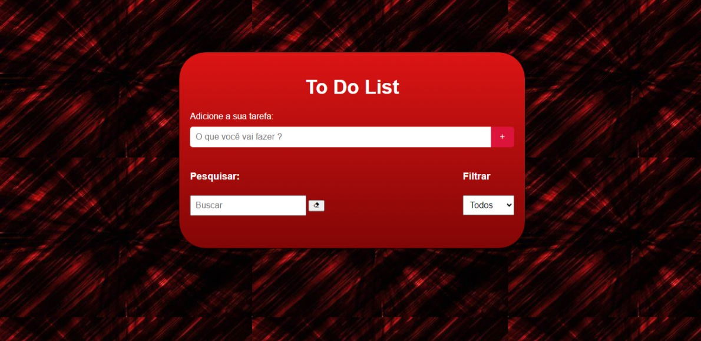

Lista de Tarefas
Este é um aplicativo simples de Lista de Tarefas construído usando HTML, CSS e JavaScript.

# Recursos
* Adicionar Tarefas: Você pode adicionar tarefas à sua lista de tarefas inserindo-as no campo de entrada e pressionando enter ou clicando no botão "+".
* Editar Tarefas: Edite facilmente as tarefas existentes clicando no botão de edição ao lado da tarefa. A tarefa mudará para o modo de edição, permitindo que você a modifique.
* Completar Tarefas: Marque as tarefas como concluídas clicando no botão de marcação ao lado da tarefa. As tarefas concluídas serão visualmente diferenciadas das incompletas.
* Remover Tarefas: Exclua tarefas da sua lista de tarefas clicando no botão de exclusão ao lado da tarefa.
* Pesquisar: Encontre tarefas específicas rapidamente usando a barra de pesquisa. Digite palavras-chave relacionadas à tarefa que você está procurando, e a lista filtrará de acordo.
* Filtrar: Filtrar tarefas com base no seu status de conclusão usando o menu suspenso. Você pode optar por ver todas as tarefas, apenas tarefas concluídas ou apenas tarefas que ainda precisam ser concluídas.
# Como Usar
* Adicionar Tarefas: Insira a tarefa que deseja adicionar no campo de entrada no topo da página e pressione enter ou clique no botão "+".
* Editar Tarefas: Clique no botão de edição ao lado da tarefa que deseja editar. Isso abrirá um formulário de edição onde você pode modificar a tarefa. Pressione enter ou clique no botão de edição para salvar suas alterações.
* Completar Tarefas: Clique no botão de marcação ao lado de uma tarefa para marcá-la como concluída. A tarefa será visualmente distinguida como concluída.
* Remover Tarefas: Clique no botão de exclusão ao lado de uma tarefa para removê-la da sua lista de tarefas.
* Pesquisar: Use a barra de pesquisa para inserir palavras-chave relacionadas à tarefa que você está procurando. A lista filtrará em tempo real para mostrar apenas tarefas que correspondam à sua pesquisa.
* Filtrar: Use o menu suspenso para filtrar tarefas com base no seu status de conclusão. Escolha entre ver todas as tarefas, apenas tarefas concluídas ou apenas tarefas que ainda precisam ser concluídas.
# Tecnologias Utilizadas
* HTML: Linguagem de marcação para criar a estrutura da página da web.
* CSS: Linguagem de folha de estilo para projetar a aparência da página da web.
* JavaScript: Linguagem de programação para implementar funcionalidades interativas e comportamento dinâmico da página da web.
# Créditos
* Boxicons: Usado para os ícones no aplicativo.
# Autor
Este aplicativo de Lista de Tarefas foi criado por José Walter De Oliveira Junior. Você pode entrar em contato comigo em "walter.jose@alunoescolassociais.org.br" para qualquer dúvida ou feedback.

Sinta-se à vontade para usar, modificar e distribuir este aplicativo de Lista de Tarefas de acordo com suas necessidades. Feliz gerenciamento de tarefas! 🚀

# ScreenShoot

